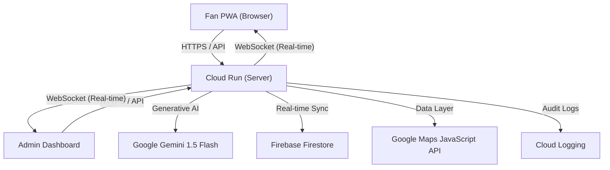

# SmartStadium AI — Architecture Overview

## System Context
SmartStadium AI is a high-performance, real-time crowd management platform designed for IPL 2026. It leverages Google Cloud services and modern web optimizations to ensure safety and efficiency during large-scale events.

## Data Flow Diagram

## Key Components

### 1. Backend (Node.js / Express)
- **Modularity**: Extracted middleware (error handling, rate limiting, validation).
- **Efficiency**: Response compression, centralized constants, SSE streaming for AI.
- **Security**: Helmet CSP, strict input validation, rate limiting.

### 2. Frontend (Vanillas JS / PWA)
- **Fan PWA**: Mobile-first, offline support via Service Worker, PWA manifest.
- **Admin Dashboard**: Real-time KPI tracking, AI announcement generation.
- **Optimizations**: `IntersectionObserver` throttling, lazy-loaded Map libraries, resource prefetching.

### 3. Google Services Integration
- **Gemini**: Powers crowd recommendations and automated PA announcements.
- **Firestore**: Real-time synchronization of zone counts and gate statuses.
- **Maps**: Visualization of crowd heatmaps and navigation.

## Optimization Philosophy
- **Performance**: Every millisecond matters. We use preload/prefetch and aggressive caching for static assets.
- **Resilience**: Graceful fallbacks for AI service outages and real-time connection drops.
- **Accessibility**: WCAG 2.1 compliance with skip links, ARIA roles, and high-contrast modes.
